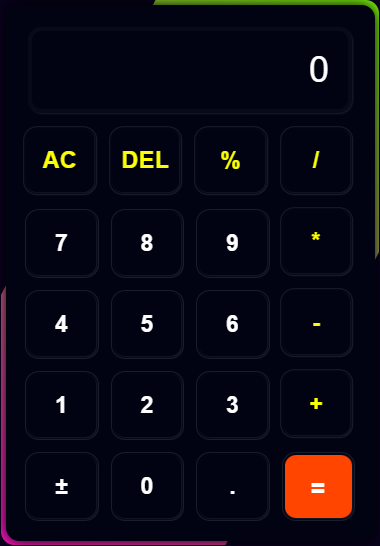

# Interactive calculator with responsive design and animated visual effects using pure HTML, CSS & JS.

# 🔢 Responsive Calculator Web App

A stylish and interactive calculator built using **HTML**, **CSS**, and **JavaScript**. This project features:

- 📱 Mobile-responsive design
- 🎨 Animated rotating border effect
- 🌙 Dark theme UI
- 🧠 JavaScript-powered functionality (AC, DEL, %, +/−, etc.)

---

## 📸 Preview

 <!-- Replace with your GitHub image link -->

---

## 🚀 Features

- Responsive layout for mobile and desktop
- Colorful rotating border animation
- Smooth hover and press effects
- Handles basic arithmetic operations
- Plus-minus toggle functionality

---

## 🛠️ Technologies Used

- HTML5
- CSS3 (Flexbox, Media Queries, Animations)
- Vanilla JavaScript

---

## 📂 Folder Structure

📁 calculator/
├── 📄 index.html
├── 📄 style.css
└── 📄 script.js